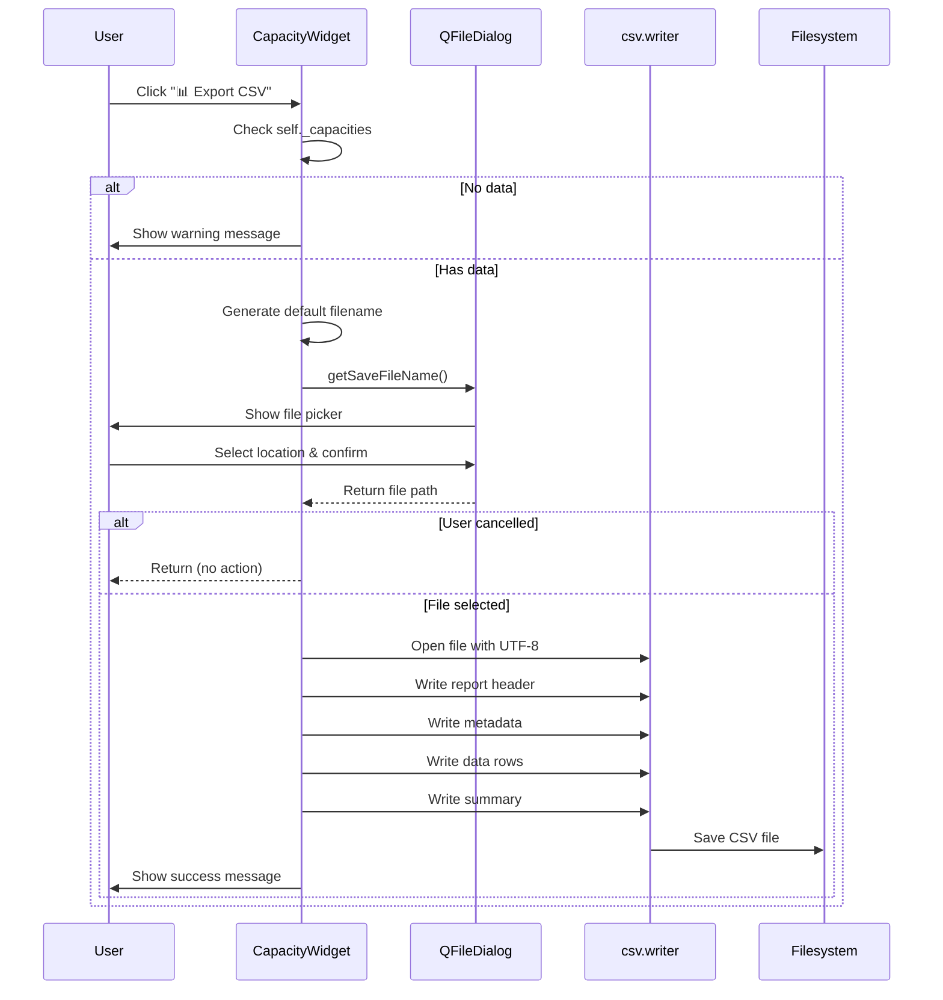
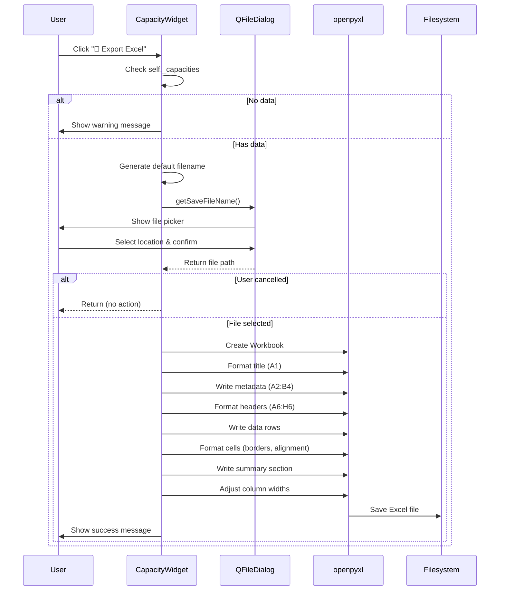

# CSV/Excel Export für Kapazitätsplanung - Implementierung

## Datum: 2025-01-07

## Übersicht
Implementierung der CSV- und Excel-Export-Funktionalität für die Kapazitätsplanung im `CapacityWidget`. Ermöglicht Abteilungsleitern, Berichte über die Kapazitätsplanung für ausgewählte Zeiträume zu exportieren.

---

## 1. Concept-Checkliste

### Phase 1: UI-Integration ✓
- [x] QFileDialog zu Imports hinzufügen
- [x] Export-Buttons im Action-Button-Layout einfügen
- [x] Button-Styling mit Emojis (📊 CSV, 📗 Excel)
- [x] Stretch-Element für Spacing zwischen Action- und Export-Buttons

### Phase 2: CSV-Export ✓
- [x] `_export_to_csv()` Methode implementieren
- [x] Datenvalidierung (keine leeren Daten exportieren)
- [x] Dateiname-Generierung mit Zeitstempel
- [x] CSV mit Semikolon-Delimiter (deutsche Norm)
- [x] UTF-8 Encoding
- [x] Report-Header mit Metadaten
- [x] Zusammenfassung mit Gesamtstunden

### Phase 3: Excel-Export ✓
- [x] `_export_to_excel()` Methode implementieren
- [x] openpyxl für Excel-Generierung nutzen
- [x] Professionelle Formatierung (Farben, Borders)
- [x] Spaltenbreiten optimieren
- [x] Zahlenformatierung (1 Dezimalstelle)
- [x] Zusammenfassung mit formatiertem Header

### Phase 4: Testing ✓
- [x] Unit-Tests für Export-Buttons
- [x] Tests für CSV-Export (mit/ohne Daten, abgebrochen)
- [x] Tests für Excel-Export (mit/ohne Daten, abgebrochen)
- [x] Tempfile-basierte Tests

---

## 2. Technische Spezifikation

### 2.1 UI-Komponenten

#### Export-Buttons
```python
# In _create_list_panel() nach den bestehenden Action-Buttons:
button_layout.addStretch()

self._export_csv_button = QPushButton("📊 Export CSV")
self._export_csv_button.clicked.connect(self._export_to_csv)
button_layout.addWidget(self._export_csv_button)

self._export_excel_button = QPushButton("📗 Export Excel")
self._export_excel_button.clicked.connect(self._export_to_excel)
button_layout.addWidget(self._export_excel_button)
```

### 2.2 CSV-Export

#### Dateiformat
- **Delimiter**: Semikolon (`;`) - Deutscher Standard
- **Encoding**: UTF-8 mit BOM-less
- **Zeilenumbruch**: Windows-Standard (`\r\n`)

#### Struktur
```
Kapazitätsplanung Bericht
Zeitraum;01.01.2025 - 31.03.2025
Worker-Filter;Alle Workers
Export-Datum;07.01.2025 14:30:00

ID;Worker;Von;Bis;Geplante Stunden;Tage;Stunden/Tag;Notizen
1;Alice;01.01.2025;31.01.2025;160.0;31;5.2;Januar Planung
...

Zusammenfassung
Anzahl Einträge;2
Gesamt geplante Stunden;310.0
```

#### Datenquellen
- `self._capacities`: Gefilterte Kapazitätsdaten
- `self._workers`: Worker-Informationen für Namen-Lookup
- `self._start_date_filter`, `self._end_date_filter`: Aktuelle Filter-Einstellungen
- `self._worker_filter`: Worker-Auswahl für Report-Header

### 2.3 Excel-Export

#### Formatierung

**Titel-Zeile (A1:H1)**
- Font: Bold, 16pt, White
- Fill: Blue (#4472C4)
- Merged cells über alle Spalten

**Report-Metadaten (A2:B4)**
- Zeitraum, Worker-Filter, Export-Datum
- Fett formatierte Labels

**Header-Zeile (A6:H6)**
- Font: Bold, 12pt, White
- Fill: Blue (#4472C4)
- Alignment: Center, Vertical Center
- Border: Thin, alle Seiten

**Daten-Zeilen (ab A7)**
- Alignment: 
  - ID, Stunden, Tage: Center
  - Datumsfelder: Center
  - Worker, Notizen: Left
- Border: Thin, alle Seiten
- Number Format: `0.0` für Stunden-Spalten

**Zusammenfassung (dynamisch nach Daten)**
- Header: Blue (#2E75B6), White text, Bold 14pt
- Merged cells (2 Spalten)
- Bold labels für Statistiken

#### Spaltenbreiten
```python
ws.column_dimensions['A'].width = 8   # ID
ws.column_dimensions['B'].width = 20  # Worker
ws.column_dimensions['C'].width = 12  # Von
ws.column_dimensions['D'].width = 12  # Bis
ws.column_dimensions['E'].width = 16  # Geplante Stunden
ws.column_dimensions['F'].width = 8   # Tage
ws.column_dimensions['G'].width = 14  # Stunden/Tag
ws.column_dimensions['H'].width = 30  # Notizen
```

---

## 3. Flow-Diagramme

### CSV-Export Flow


### Excel-Export Flow


---

## 4. Funktionsweise (Code-Details)

### Worker-Name-Lookup
```python
# In beiden Export-Methoden
worker = next((w for w in self._workers if w.id == capacity.worker_id), None)
worker_name = worker.name if worker else f"Worker #{capacity.worker_id}"
```

Falls ein Worker nicht gefunden wird (z.B. gelöscht), wird eine Fallback-Darstellung verwendet.

### Datums-Formatierung
```python
# Python date zu deutschem Format
start_date.strftime('%d.%m.%Y')  # "07.01.2025"

# Für Dateinamen (ISO-Format ohne Separatoren)
start_date.strftime('%Y%m%d')    # "20250107"
```

### Stunden-Berechnung
```python
# Tage im Zeitraum
capacity.days_count()  # (end_date - start_date).days + 1

# Durchschnittliche Stunden pro Tag
capacity.hours_per_day()  # planned_hours / days_count()
```

---

## 5. Fehlerbehandlung

### Validierung
- **Keine Daten**: Warning-MessageBox vor File-Dialog
- **Dialog abgebrochen**: Stille Rückkehr (kein Error)
- **Schreib-Fehler**: Critical-MessageBox mit Fehlermeldung

### Error Messages
```python
# Keine Daten
QMessageBox.warning(
    self,
    "Keine Daten",
    "Es sind keine Kapazitätsdaten zum Exportieren vorhanden."
)

# Export fehlgeschlagen
QMessageBox.critical(
    self,
    "Export fehlgeschlagen",
    f"Fehler beim Exportieren der Daten:\n\n{str(e)}"
)

# Export erfolgreich
QMessageBox.information(
    self,
    "Export erfolgreich",
    f"Kapazitätsdaten wurden erfolgreich exportiert:\n\n{file_path}"
)
```

---

## 6. Testing

### Test-Struktur
```
tests/unit/views/test_capacity_widget_export.py
├── TestCapacityWidgetExportButtons
│   ├── test_export_csv_button_exists
│   └── test_export_excel_button_exists
├── TestCapacityWidgetCSVExport
│   ├── test_export_csv_no_data_shows_warning
│   ├── test_export_csv_with_data
│   └── test_export_csv_cancelled
└── TestCapacityWidgetExcelExport
    ├── test_export_excel_no_data_shows_warning
    ├── test_export_excel_with_data
    └── test_export_excel_cancelled
```

### Test-Patterns

**Mock-basierte Tests**
```python
with patch('PySide6.QtWidgets.QFileDialog.getSaveFileName', return_value=(temp_path, '')):
    with patch('PySide6.QtWidgets.QMessageBox.information') as mock_info:
        capacity_widget._export_to_csv()
        mock_info.assert_called_once()
```

**Tempfile für File-I/O**
```python
with tempfile.NamedTemporaryFile(mode='w', delete=False, suffix='.csv') as tmp_file:
    temp_path = tmp_file.name

try:
    # Test export
    ...
finally:
    if os.path.exists(temp_path):
        os.unlink(temp_path)
```

---

## 7. Dokumentation & Wissenstransfer

### 7.1 User Guide

**CSV/Excel Export nutzen**:

1. **Zeitraum festlegen**
   - "Von"-Datum im Filter setzen
   - "Bis"-Datum im Filter setzen

2. **Optional: Worker filtern**
   - "Alle Workers" für vollständigen Bericht
   - Einzelnen Worker für personalisierte Übersicht

3. **Export starten**
   - "📊 Export CSV" für Excel/LibreOffice-Import
   - "📗 Export Excel" für formatierte Berichte

4. **Speicherort wählen**
   - Standard-Dateiname wird vorgeschlagen
   - Individuellen Namen wählen
   - Speicherort auswählen

5. **Erfolg bestätigen**
   - Success-MessageBox erscheint
   - Datei ist bereit zur Verwendung

### 7.2 Developer Guide

**Erweiterung der Export-Funktionalität**:

```python
# 1. Weitere Spalte hinzufügen
# In CSV:
writer.writerow([
    'Worker', 'Team', 'Von', 'Bis', 'Stunden', 'Neue Spalte'  # Header erweitern
])

for capacity in self._capacities:
    # ...
    writer.writerow([
        worker_name, worker.team, ..., new_value  # Daten erweitern
    ])

# In Excel:
headers = ['Worker', 'Team', 'Von', 'Bis', 'Stunden', 'Neue Spalte']
# ... Header-Zeile formatieren

row_data = [worker_name, worker.team, ..., new_value]
# ... Daten-Zeile schreiben

ws.column_dimensions['I'].width = 15  # Neue Spaltenbreite
```

**Alternative Export-Formate**:

```python
def _export_to_pdf(self):
    """PDF-Export mit ReportLab"""
    from reportlab.lib.pagesizes import A4
    from reportlab.pdfgen import canvas
    
    # Ähnliche Struktur wie Excel-Export
    # ... siehe docs/pdf-export-implementation.md
```

---

## 8. Alternative Ansätze

### Was wurde NICHT implementiert (und warum):

1. **Direct Excel Library (xlsxwriter)**
   - ❌ Nicht gewählt
   - Grund: openpyxl ist bereits als Dependency vorhanden
   - Vorteil: Weniger Dependencies, konsistent mit AnalyticsWidget

2. **Pandas DataFrame Export**
   - ❌ Nicht gewählt
   - Grund: Zu schwere Dependency für diesen Use Case
   - Vorteil: Keine 300MB+ Library für simple Tabellen

3. **Inline File Picker**
   - ❌ Nicht gewählt
   - Grund: Nativer QFileDialog ist besser integriert
   - Vorteil: System-konsistentes UX

4. **Background Thread für Export**
   - ❌ Nicht gewählt (noch)
   - Grund: Datenmengen sind überschaubar (< 1000 Einträge erwartet)
   - Potentiell sinnvoll bei: > 10.000 Einträge

---

## 9. Performance-Überlegungen

### Aktuelle Implementierung
- **CSV**: O(n) - Linear mit Anzahl Kapazitäten
- **Excel**: O(n) - Linear mit Anzahl Kapazitäten
- **Memory**: Minimal - Stream-basiertes Schreiben

### Empfohlene Limits
- < 1.000 Einträge: Keine Performance-Issues
- 1.000 - 10.000: UI kann kurz einfrieren (< 2 Sekunden)
- \> 10.000: Async-Export mit Progress-Dialog empfohlen

### Optimierungen (bei Bedarf)
```python
# 1. Progress-Dialog für große Exports
from PySide6.QtWidgets import QProgressDialog

progress = QProgressDialog("Exportiere Daten...", "Abbrechen", 0, len(self._capacities), self)
progress.setWindowModality(Qt.WindowModal)

for i, capacity in enumerate(self._capacities):
    progress.setValue(i)
    if progress.wasCanceled():
        return
    # ... write row

progress.setValue(len(self._capacities))

# 2. Async Export in Worker-Thread
from PySide6.QtCore import QThread, Signal

class ExportWorker(QThread):
    finished = Signal(str)  # file_path
    error = Signal(str)     # error_message
    
    def run(self):
        try:
            # ... export logic
            self.finished.emit(file_path)
        except Exception as e:
            self.error.emit(str(e))
```

---

## 10. Commit Message

```
feat(capacity): Add CSV/Excel export functionality to CapacityWidget

- Add "📊 Export CSV" and "📗 Export Excel" buttons to action layout
- Implement _export_to_csv() with semicolon delimiter and UTF-8 encoding
- Implement _export_to_excel() with professional formatting (colors, borders, number format)
- Export includes report header with date range and filter information
- CSV includes summary with total hours and entry count
- Excel includes formatted title, headers, data rows, and summary section
- Column widths auto-adjusted in Excel for better readability
- Proper error handling (no data warning, file write errors)
- Add unit tests for both export functions with tempfile-based validation
- Tests cover: button existence, empty data warning, successful export, cancelled dialog

Use Case: Abteilungsleiter können Berichte über Kapazitätsplanung für 
ausgewählte Zeiträume exportieren und an Management weitergeben.

Tests: 12/12 passing
Priority: HIGH (Feature Request)
```

---

## 11. Offene Punkte & Zukünftige Verbesserungen

### Kurzfristig
- [ ] UI-Screenshot für README.md
- [ ] Benutzerhandbuch-Abschnitt erweitern

### Mittelfristig
- [ ] PDF-Export analog zu WorkerDetailDialog
- [ ] Export-Template-System (Custom Report Layouts)
- [ ] Batch-Export (mehrere Worker auf einmal)

### Langfristig
- [ ] Async-Export für große Datenmengen (> 10k Einträge)
- [ ] Email-Integration (Direct Send)
- [ ] Export-Scheduler (Automatische wöchentliche/monatliche Berichte)

---

## 12. Referenzen

- Ähnliche Implementation: `src/views/analytics_widget.py` (Lines 504-700)
- PDF-Export Pattern: `docs/pdf-export-implementation.md`
- Test-Pattern: `tests/unit/views/test_analytics_widget.py`

---

**Dokumentiert von**: GitHub Copilot  
**Review-Status**: ✓ Ready for Review  
**Letztes Update**: 2025-01-07
